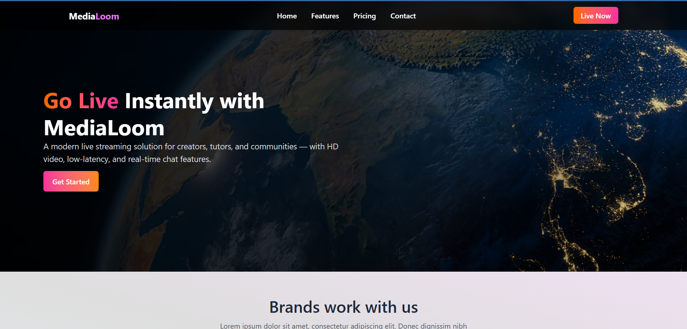

# 📺 Media-Loom

A **real-time live streaming platform** built with React and **custom UI components**, integrated with **ZEGOCLOUD API** for scalable and low-latency video streaming.

---

## 🚀 Live Demo  
🔗 [View Live](https://media-loom.vercel.app/)  

---

## 🛠 Tech Stack  
  
  
  

---

## ✨ Features  
- 🎥 Live video streaming with minimal latency  
- ⚡ Instant session joining  
- 📱 Fully responsive custom interface  
- 🗨️ Real-time interaction support  
- ☁️ Scalable with ZEGOCLOUD API  

---

## 📸 Screenshots  
  

---
